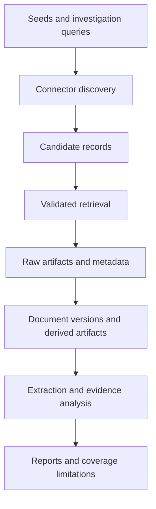

# Acquisition and Provenance Data Flow

## Status

Accepted as the architectural basis for acquisition development after the
normalized Source model.

## Purpose

Argus must acquire evidence from more than a manually maintained collection of
news feeds.

The platform should support current and historical media, scientific
publications, official records, legislation, archives, statistical datasets,
financial reports, technical documents, and other attributable information
artifacts.

The system cannot guarantee complete coverage of all available information.
It must instead make acquisition scope, failures, restrictions, and coverage
limitations visible and reproducible.

## Core principles

1. Discovery and trust assessment are separate operations.
2. A discovered source is not automatically accepted as reliable.
3. Original artifacts are preserved before normalization.
4. Derived text never replaces its original artifact.
5. Every retrieval is recorded.
6. Document versions remain distinguishable.
7. Connectors implement protocols, not individual analytical assumptions.
8. Missing evidence is not evidence of absence.
9. Access restrictions and licenses are part of provenance.
10. Acquisition results must be reproducible where external systems permit it.

## Acquisition modes

### Continuous monitoring

Continuous monitoring follows configured seeds and previously discovered
endpoints.

Examples include:

- RSS and Atom feeds;
- official publication APIs;
- legislative updates;
- statistical releases;
- scientific metadata updates;
- corporate filings;
- corrections and retractions.

### Investigation-driven discovery

Investigation-driven discovery starts from an analytical question.

It may:

- search catalogs;
- follow citations;
- discover referenced datasets;
- locate primary documents;
- retrieve historical versions;
- search for contradicting evidence;
- expand through entities and related events.

Every investigation must record the catalogs, endpoints, queries, languages,
time ranges, filters, and stopping conditions used.

## High-level flow



## Acquisition entities

### Source

A person, organization, institution, publisher, or system responsible for
making information available.

Source metadata provides context and must not be treated as a truth score.

### Collection endpoint

A technical location or interface used to discover or retrieve information.

Examples include:

- RSS or Atom feed;
- REST API;
- OAI-PMH repository;
- IIIF manifest;
- SDMX service;
- SPARQL endpoint;
- sitemap;
- web archive;
- dataset catalog.

One source may expose many endpoints. An endpoint may also aggregate records
from many sources.

### Candidate record

A lightweight discovery result that has not yet been fully retrieved or
accepted.

It may contain an external identifier, title, location, source hint, media
type, date, language, and discovery provenance.

### Retrieval record

A record of one acquisition attempt.

It should contain:

- endpoint;
- connector and connector version;
- request time;
- request parameters;
- response status;
- resolved location;
- redirect information;
- content type;
- response hash;
- access and license metadata;
- errors and warnings.

### Raw artifact

The unchanged bytes received by Argus.

Examples include HTML, PDF, XML, JSON, CSV, images, audio, and video.

Raw artifacts receive a content hash and must not be silently rewritten.

### Document

A logical attributable information object, such as an article, report, law,
speech, scientific work, or historical record.

### Document version

A specific state of a document at a particular time.

A new retrieval with different content does not silently overwrite the
previous version.

### Derived artifact

A product created from a raw artifact.

Examples include:

- extracted text;
- OCR output;
- transcription;
- translation;
- normalized metadata;
- parsed table;
- converted document format.

Every derived artifact must identify its input, method, method version,
creation time, and quality limitations.

## Connector boundary

A connector is responsible for protocol-specific discovery and retrieval.

Conceptually, connectors provide operations equivalent to:

```python
class Connector:
    def discover(self, request):
        ...

    def retrieve(self, candidate):
        ...

```
Connectors return normalized acquisition contracts. They do not create claims,
determine truth, classify propaganda, or produce analytical conclusions.

Initial connector families should include:

- RSS and Atom;
- scholarly metadata APIs;
- OAI-PMH repositories;
- statistical-data APIs.

Relevant open standards and catalogs include:

- Crossref REST API;
- OpenAlex API;
- OAI-PMH;
- IIIF;
- W3C DCAT;
- SDMX;
- W3C PROV-O.

## Candidate lifecycle

Acquisition candidates may move through the following states:

- discovered;
- validated;
- registered;
- scheduled;
- retrieved;
- parsed;
- rejected;
- quarantined;
- unavailable;
- access restricted;
- superseded.

Rejection and quarantine require explicit reasons.

## Evidence quality boundary

Acquisition stores provenance and measurable quality indicators. It does not
assign one permanent reliability percentage to a source.

Future evidence assessment may separately consider:

- source identity;
- artifact authenticity;
- primary or secondary status;
- directness;
- temporal proximity;
- expertise;
- methodology;
- independence;
- corroboration;
- corrections or retractions;
- conflicts of interest;
- context completeness;
- extraction, OCR, transcription, or translation quality.

Assessments must be versioned and evidence-backed.

## Coverage reporting

Every investigation should eventually report:

- connectors used;
- catalogs and endpoints queried;
- time and language coverage;
- unavailable or restricted material;
- failed retrievals;
- geographic and institutional gaps;
- stopping conditions;
- known corpus bias.

## Incremental transition

The existing RSS pipeline remains operational.

The transition will proceed as follows:

1. define protocol-independent acquisition contracts;
2. adapt RSS collection to those contracts;
3. introduce collection endpoints and retrieval records;
4. introduce raw-artifact storage;
5. define documents and document versions;
6. migrate existing articles into the document model;
7. add one scholarly connector;
8. add one statistical connector;
9. add archive discovery;
10. introduce evidence-quality assessments.

Existing Article processing will not be removed until the replacement path is
implemented, migrated, tested, and documented.