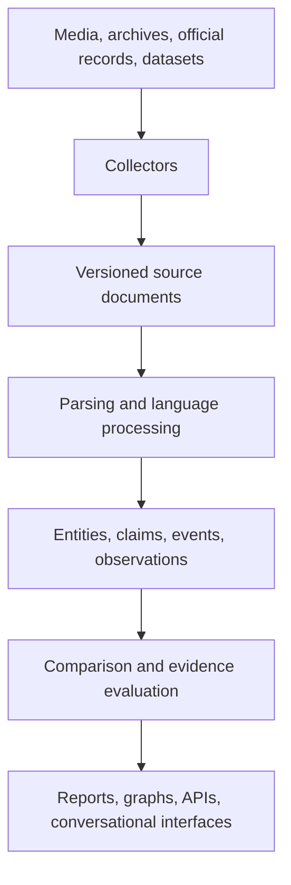

# Argus Architecture Overview

## What is Argus?

Argus is an explainable information-space analysis platform.

Argus is not a news aggregator or a general-purpose chatbot.

Its goal is to observe the global information space, extract measurable
information, compare narratives, and provide transparent analytical reports.

Argus may expose conversational interfaces for querying and explaining its
results. These interfaces operate on evidence-backed application services and
do not replace the analytical core.

---

# Mission

To create a transparent, explainable and reproducible system capable of analysing how information spreads, changes and influences society.

---

# Core Principles

## Explainability

Every conclusion produced by Argus must be traceable to measurable evidence.

The user should always be able to understand why the system reached a particular conclusion.

---

## Measurements before conclusions

Argus measures language first.

Interpretation comes only after enough measurable evidence has been collected.

---

## Evidence over authority

No statement is accepted as true solely because of its source.

Every claim must be evaluated using available evidence.

---

## Events are primary

Articles are not the main object of the system.

They are evidence describing real-world events.

---

## Claims are atomic

Every document should be decomposed into independent factual claims whenever possible.

---

## Reproducibility

Running the same analysis on the same data should produce identical results.

---

## Transparency

Argus should avoid black-box decisions whenever possible.

Every score should be decomposable into intermediate calculations.

---

## Modularity

Every subsystem should solve exactly one problem.

Communication between modules should happen through clearly defined interfaces.

---

# High-Level Workflow

# Architecture Documents

- [Platform Scope and Boundaries](platform_scope.md)
- [Acquisition and Provenance Data Flow](data_flow.md)
- [Argus Data Model](data_model.md)
- [Processing Pipeline](pipeline.md)